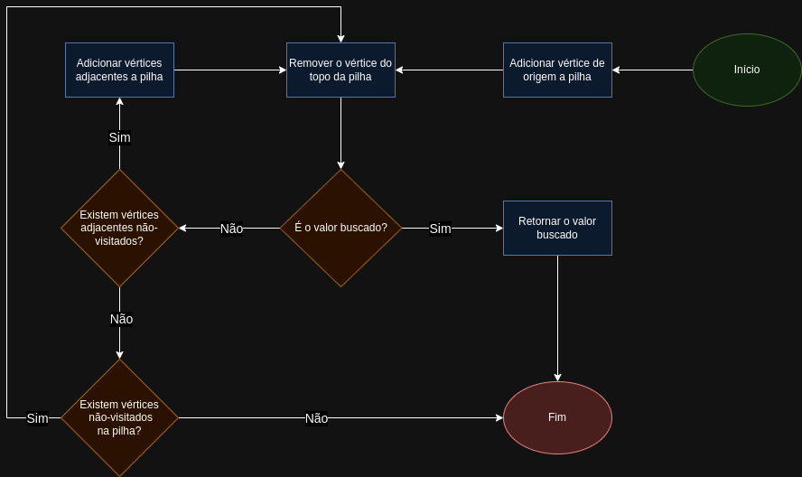

# Busca em Grafos
Para cada estratégia de busca, existe uma ordem de visitação diferente, o que pode influenciar em termos de performance de busca e na possiilidade de se encontrar o menor caminho entre dois vértices.
## Busca em Profundidade
Consiste em se aprofundar no grafo, ou seja, se estamos num ponto do grafo e ainda existe caminho a ser pecorrido, seguimos esse caminho até que não exista mais caminho. Se tratando de árvores, seguimos até alcançarmos uma folha. Se tratando de grafos que podem conter ciclos, seguimos até encontrarmos um vértice que já foi visitado. Quando já percorremos tudo ao redor, voltamos ao vértice anterior (*backtracking*) até encontrar um caminho não explorado. A busca acaba quando encontramos o que estamos buscando ou quando visitamos todos os vértices do grafo. Essa estratégia não garante que encontramos o menor caminho até o vértice de interesse.
### Implementação da busca em profundidade
Como precisaremos voltar (*backtracking*) sempre que nos depararmos com um "beco sem saída", iremos utilizar uma pilha para organizarmos os vértices visitados. Seguiremos os seguintes procedimentos:
1. Ao visitarmos a origem, iremos adicioná-la à pilha
2. Em seguida, iremos removê-lo da pilha, verificar se é o valor que buscamos e adicionar seus filhos que ainda não foram visitados
3. Repetimos o procedimento `1` e `2` para o filho no topo da pilha até que não existam mais filhos para empilhar, nesse caso, iremos desempilhar os próximos filhos da origem, que já estão na pilha desde o começo
4. Encerramos a busca em profundidade quando a pilha está vazia

## Busca em Largura
Consiste em explorar sem se afastar tanto do ponto inicial. Seguiremos todos os caminhos próximos a origem antes de nos aprofundarmos para o próximo nível. Basicamente, iremos visitar todos os vérices filhos antes de partir para os vértices netos e os seguintes. Quando encontramos o que buscamos através dessa estratégia, garantimos que esse é o caminho mais curto da origem até o vértice que buscamos.
### Implementação da busca em largura
Como queremos visitar todos os filhos antes de ir para o próximo nível, iremos utilizar uma fila para guardar os vértices que serão visitados em ordem. Seguiremos os seguintes procedimentos:
1. Ao visitarmos a origem, iremos adicioná-la à fila
2. Em seguida, iremos removê-la da fila, verificar se é o valor que buscamos e enfileirar seus filhos que ainda não foram visitados
3. Repetiremos o procedimento `1` e `2` para o filho na frente da fila: removendo-o, verificando se é o valor que procuramos e enfileirando seus filhos
4. Encerramos a busca em largura quando a fila estiver vazia